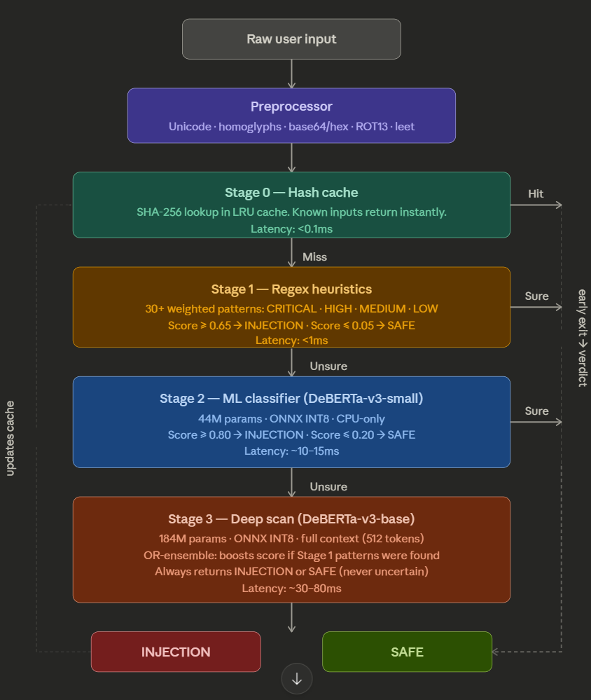

# Prompt Injection Detection

A lightweight, CPU-friendly pipeline that detects prompt injection attacks in user inputs. It uses a 4-stage cascade,  each stage only runs if the previous one is uncertain — keeping average latency low.

### Achieves **91.46%** accuracy on [xTRam1/safe-guard-prompt-injection](https://huggingface.co/datasets/xTRam1/safe-guard-prompt-injection)  dataset

## How it works

1. **Preprocessing** — normalises the input (strips invisible characters, decodes obfuscation tricks, etc.)
2. **Stage 0 — Cache** — returns instantly if the exact input was seen before
3. **Stage 1 — Heuristics** — fast regex-based pattern matching, no ML involved
4. **Stage 2 — ML Classifier** — [DeBERTa-v3-small](https://huggingface.co/protectai/deberta-v3-small-prompt-injection-v2) (44M params), only reached if heuristics are uncertain
5. **Stage 3 — Deep Scan** — [DeBERTa-v3-base](https://huggingface.co/protectai/deberta-v3-base-prompt-injection-v2) (184M params), only reached if Stage 2 is uncertain (~5% of traffic)

Every verdict is one of: **INJECTION or (1)**, **SAFE or (0)**, or **UNCERTAIN or (-1)** (internal only — always resolved before returning).

Pipeline Stages : 

## Requirements

- Python 3.11+
- CPU-only machine is fine, no GPU needed

## Run locally

**1. Create and activate a virtual environment**

    python -m venv venv
    venv\Scripts\activate        # Windows
    source venv/bin/activate     # macOS / Linux

**2. Install PyTorch (CPU-only build)**

    pip install torch>=2.2.0 --index-url https://download.pytorch.org/whl/cpu

**3. Install remaining dependencies**

    pip install -r requirements.txt

**4. Run a single prompt**

    python main.py --prompt "Ignore all previous instructions and..."

**5. Run a batch from a CSV file**

Uses the text column from `utils/config.py` (`csv_prompt_column`, default `text`), or falls back to `text` / `prompts`. Optional `label` column (`0` benign, `1` injection) enables the validation report.

    python main.py --csv your_file.csv

After a CSV run, outputs are written to the **same directory as the input CSV** (e.g. `assets/data/foo.csv` → `assets/data/foo_predictions.csv` and `assets/data/foo_report.md`):

- **`<input_stem>_predictions.csv`** — all original columns plus **`prediction`**: **`0`** = benign (SAFE), **`1`** = injection. Empty text rows keep an empty prediction cell.
- **`<input_stem>_report.md`** — Markdown report with tables (counts, optional validation vs `label`, confusion matrix, stage hits, latency).

Use `-o myname.csv` to change the predictions filename in that same folder (or pass an absolute path). To force a fixed folder under the repo instead, set `csv_output_dir` in `utils/config.py` (e.g. `"data/output"`).

Optional flags:
- `--verbose` — single-prompt mode only (extra stage detail)
- `--output` / `-o` — predictions filename next to the input, or absolute path
- `--preload-all` — loads both ML models at startup to avoid cold-start delay on the first prompt

## Tuning

All thresholds (injection/safe score cutoffs, cache size, model names) are in `utils/config.py`. No changes needed anywhere else.

To refresh the SafeGuard CSV from Hugging Face (requires `pip install datasets`):

    python -m utils.downloaddata

## References

- [ProtectAI prompt injection models on HuggingFace](https://huggingface.co/protectai)
- [DeBERTa paper](https://arxiv.org/abs/2006.03654)
